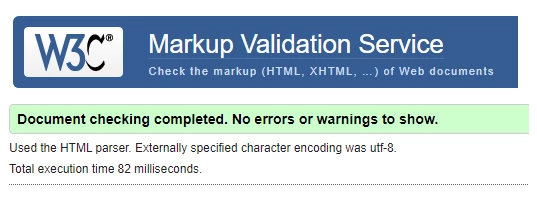
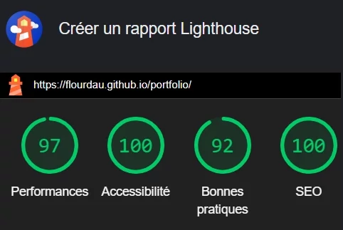

#       PORTFOLIO - OC_Projet08

####    *Projet 08 de la Formation Développeur Web d'Openclassrooms.*
##      Créez et publiez votre portfolio de développeur
####    Faites le point sur vos compétences, préparez votre recherche d'emploi et déployez votre portfolio en ligne pour donner de la visibilité à vos projets.

-   ### [OpenClassrooms Mission Details](https://openclassrooms.com/fr/paths/717/projects/1335/assignment)
-   ### [Blog post](https://blog.positive-link.net/oc_projet08)
-   ### [Figma mockup](https://www.figma.com/file/Snidyc45xi6qchoOPabMA9/Maquette-Mon-Vieux-Grimoir?node-id=0%3A1)

## Available Scripts

In the project directory, you can run:

### `yarn install`

Install dependences.

### `yarn start`

Runs the app in the development mode.\
Open [http://localhost:3000](http://localhost:3000) to view it in your browser.

The page will reload when you make changes.\
You may also see any lint errors in the console.  

  
